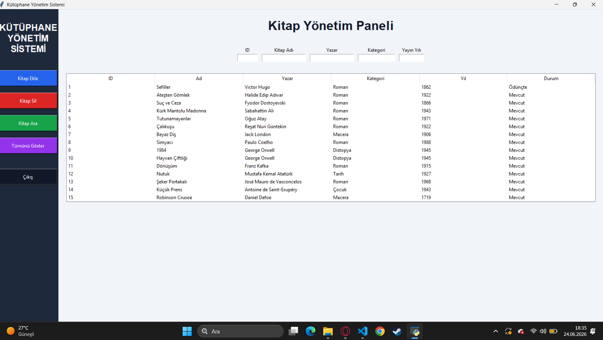
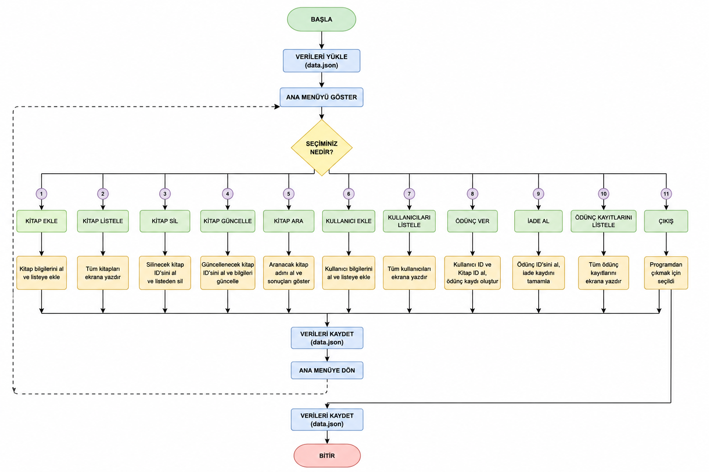

# Kütüphane Yönetim Sistemi

Python programlama dili kullanılarak geliştirilen bu proje, nesne yönelimli programlama (OOP) prensipleri temel alınarak hazırlanmış bir **Kütüphane Yönetim Sistemi** uygulamasıdır. Sistem; kitap, kullanıcı ve ödünç işlemlerinin yönetilmesini sağlayarak kütüphane süreçlerini dijital ortamda takip etmeyi amaçlamaktadır.

Projede veriler JSON dosyasında saklanmakta ve program yeniden çalıştırıldığında otomatik olarak yüklenmektedir. Uygulama hem konsol tabanlı hem de Tkinter ile geliştirilmiş grafiksel kullanıcı arayüzü (GUI) üzerinden kullanılabilmektedir.

---

## Özellikler

* Kitap ekleme
* Kitap listeleme
* Kitap silme
* Kitap güncelleme
* Kitap arama
* Kullanıcı ekleme
* Kullanıcı listeleme
* Kitap ödünç verme
* Kitap iade etme
* Ödünç kayıtlarını görüntüleme
* JSON tabanlı veri saklama
* Program yeniden açıldığında kayıtları yükleme
* Tkinter ile geliştirilmiş grafiksel kullanıcı arayüzü (GUI)

---

## Kullanılan Teknolojiler

* Python 3.12
* Tkinter
* JSON
* Nesne Yönelimli Programlama (OOP)
* Git & GitHub

---

## Proje Yapısı

| Dosya        | Açıklama                                     |
| ------------ | -------------------------------------------- |
| main.py      | Konsol tabanlı uygulamanın başlangıç dosyası |
| arayuz.py    | Grafiksel kullanıcı arayüzü                  |
| kutuphane.py | Kütüphane işlemlerinin yönetildiği ana sınıf |
| kitap.py     | Kitap sınıfı                                 |
| kullanici.py | Kullanıcı sınıfı                             |
| odunc.py     | Ödünç kayıtları sınıfı                       |
| data.json    | Verilerin saklandığı dosya                   |

---

## Çalıştırma

### Konsol Arayüzü

```bash
python main.py
```

### Grafiksel Arayüz (GUI)

```bash
python arayuz.py
```

---

## Arayüz Görüntüsü

Aşağıda uygulamanın grafiksel kullanıcı arayüzüne ait ekran görüntüsü yer almaktadır.



---

## Akış Şeması

Projenin çalışma mantığı ve işlem akışı aşağıdaki akış şeması ile gösterilmiştir.



---

## Proje Tasarımı

Projenin tasarım süreci Tinkercad ortamında planlanmış ve akış şeması oluşturulmuştur.

**Tinkercad Tasarım Bağlantısı:**
BURAYA_TINKERCAD_LINKINI_EKLE

---

## Geliştirici

**Hilal Şenses**
Bilgisayar ve Öğretim Teknolojileri Eğitimi (BÖTE) – 2. Sınıf

İleri Programlama Dersi Dönem Sonu Projesi
